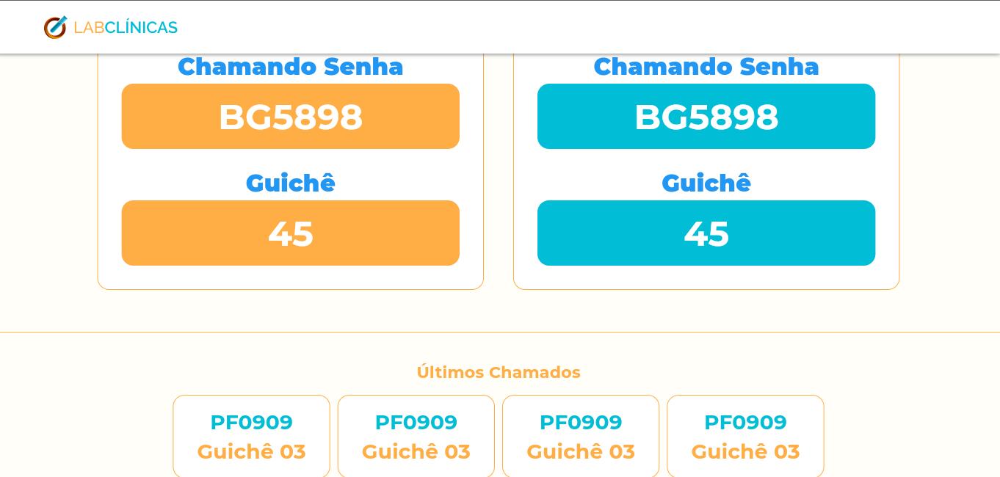

# fe_lab_clinicas_panel

Projeto do Flutter Expirience.

## Ínicio

Este é mais um projeto que foi realizado durante o evento Flutter Expirience, o útlimo para ser exato. Este é o painel, versão Web para ser utilizado em televisores exibindo as chamadas. Obs: Não foi implementado o webscoket para interação de chamadas.

## O quer foi usado?

Neste projeto foi usado a arquitetura mvvm(Model view Model), a mesma dos outros projetos. Com os principais pacote flutter_getit para injeção de dependências, e signals para gerência de estado.

Pacote criado durante evento para núcleo de funcionamento:
- [Lab Clinicas Core](https://github.com/emanuelxenos/lab_clinicas_core)

## Captura de telas do projeto

